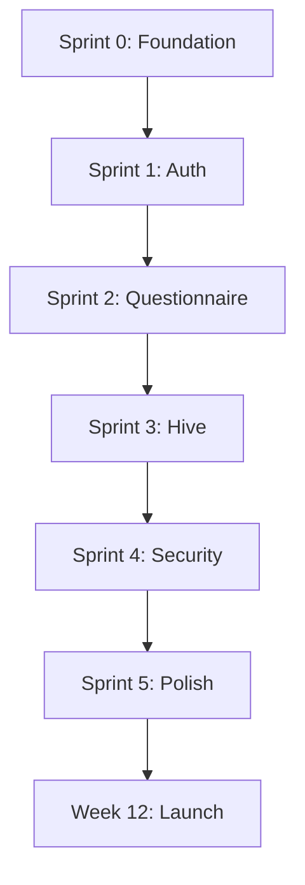

# R3AL Build Timeline & Sprint Breakdown

**Version:** 1.0.0-beta  
**Target Launch:** 90 days from sprint start  
**Team Structure:** 2 Frontend, 1 Backend, 1 DevOps, 1 QA

---

## 📋 Overview

This document provides a sprint-by-sprint breakdown of the R3AL app build, including tasks, dependencies, durations, and success criteria.

---

## 🎯 Milestones

| Milestone | Target Date | Deliverable |
|-----------|-------------|-------------|
| Sprint 0 Complete | Week 1 | Infrastructure & Design System |
| Sprint 1 Complete | Week 3 | Auth & Onboarding Flow |
| Sprint 2 Complete | Week 5 | Questionnaire & Trust Vault |
| Sprint 3 Complete | Week 7 | Hive & Social Features |
| Sprint 4 Complete | Week 9 | Security & Integrity System |
| Sprint 5 Complete | Week 11 | Beta Launch Prep |
| Beta Launch | Week 12 | Public Beta Release |

---

## 🏃 Sprint Breakdown

### **SPRINT 0: Foundation (Week 1)**

**Goal:** Set up infrastructure, design system, and development environment

**Tasks:**

#### Backend Setup
- [ ] Configure Hono server with tRPC routes (2 days)
- [ ] Set up PostgreSQL database schema (2 days)
- [ ] Implement authentication middleware (1 day)
- [ ] Create user model & migrations (1 day)

#### Design System
- [ ] Implement UI tokens from `ui_tokens.json` (1 day)
- [ ] Create reusable component library (2 days)
  - Buttons, cards, inputs, modals
  - Typography system
  - Color palette & gradients
- [ ] Design fractured mask logo animations (2 days)

#### DevOps
- [ ] Configure CI/CD pipeline (2 days)
- [ ] Set up staging environment (1 day)
- [ ] Implement error tracking (Sentry) (1 day)

**Dependencies:** None  
**Success Criteria:** 
- All developers can run app locally
- Design system components render correctly
- Backend health checks pass

---

### **SPRINT 1: Auth & Onboarding (Weeks 2-3)**

**Goal:** Complete user authentication and onboarding flow

**Tasks:**

#### Authentication (Week 2)
- [ ] Implement login/register screens (2 days)
  - Email/password
  - OAuth (Google, Apple)
- [ ] 2FA implementation (2 days)
  - SMS/email codes
  - TOTP support
- [ ] Guest mode for beta (1 day)
- [ ] Session management & token refresh (2 days)

#### Onboarding Flow (Week 3)
- [ ] Splash screen with heartbeat animation (1 day)
- [ ] Promo/Learn More screen (2 days)
  - Tier comparison table
  - Trust Token preview
- [ ] NDA consent screen (1 day)
- [ ] Privacy agreement screen (1 day)
- [ ] ID verification integration (3 days)
  - Provider API integration
  - Document upload & validation
  - Skip flow for beta

**Dependencies:** Sprint 0 complete  
**Success Criteria:**
- Users can register, login, and complete onboarding
- 2FA works on mobile & web
- Guest mode functional for beta testers

---

### **SPRINT 2: Questionnaire & Trust Vault (Weeks 4-5)**

**Goal:** Build psychometric questionnaire and trust scoring system

**Tasks:**

#### Questionnaire System (Week 4)
- [ ] Question renderer component (2 days)
  - Multiple choice
  - Likert scale
  - Free text
  - Slider
- [ ] Progress tracking & auto-save (1 day)
- [ ] Attention checks & consistency validation (2 days)
- [ ] Response time measurement (1 day)

#### Trust Scoring Engine (Week 5)
- [ ] Implement scoring algorithm (3 days)
  - Weighted composite model
  - Lie scale detection
  - Consistency checks
  - Response time analysis
- [ ] Integrity dashboard UI (2 days)
  - Score visualization
  - Category breakdown
  - Trend charts
- [ ] Photo validation integration (2 days)
  - AI-generated detection
  - Filter detection
  - Trust badge assignment

**Dependencies:** Sprint 1 complete  
**Success Criteria:**
- Questionnaire saves responses in real-time
- Trust score calculates accurately
- Photo validation rejects AI/filtered images

---

### **SPRINT 3: Hive & Social (Weeks 6-7)**

**Goal:** Build community features and social interactions

**Tasks:**

#### Hive Core (Week 6)
- [ ] Circle system implementation (3 days)
  - Create/join circles
  - Tier-based limits
  - Member management
- [ ] Feed & posts (2 days)
  - Create/edit/delete posts
  - Image attachments
  - Comment threads
- [ ] User profiles (2 days)
  - Public profile view
  - Trust badge display
  - Activity feed

#### Social Features (Week 7)
- [ ] Messaging system (3 days)
  - Direct messages
  - Screenshot detection
  - Read receipts
- [ ] Commendations (1 day)
  - Give/receive commendations
  - Impact on trust score
- [ ] Reporting & moderation (2 days)
  - Report content/users
  - Admin moderation dashboard
  - Strike system

**Dependencies:** Sprint 2 complete  
**Success Criteria:**
- Users can join circles and post content
- Messaging works with screenshot protection
- Moderation tools functional

---

### **SPRINT 4: Security & Integrity (Weeks 8-9)**

**Goal:** Implement security features and integrity monitoring

**Tasks:**

#### Screenshot Protection (Week 8)
- [ ] Mobile screenshot detection (2 days)
  - iOS/Android listeners
  - Haptic feedback
  - Alert system
- [ ] Web screenshot detection (1 day)
  - Keyboard shortcut detection
  - DevTools monitoring
- [ ] Capture history screen (1 day)
- [ ] Appeal form & workflow (2 days)

#### Integrity System (Week 9)
- [ ] Strike system implementation (2 days)
  - Automatic restrictions
  - Feature lockouts
  - Expiration logic
- [ ] Escalation workflow (2 days)
  - Supervisor notifications
  - Case management
  - User appeals
- [ ] Integrity index calculation (1 day)
  - Behavior score
  - Community score
  - Photo score
- [ ] Public badge system (1 day)

**Dependencies:** Sprint 3 complete  
**Success Criteria:**
- Screenshot detection works on all platforms
- Strike system restricts violators
- Integrity scores update weekly

---

### **SPRINT 5: Polish & Launch Prep (Weeks 10-11)**

**Goal:** Bug fixes, performance optimization, and launch readiness

**Tasks:**

#### Tutorial & Onboarding (Week 10)
- [ ] Tutorial system implementation (2 days)
  - Interactive overlays
  - Optima AI assistant integration
  - Tutorial completion tracking
- [ ] Onboarding improvements (1 day)
  - Error handling
  - Loading states
  - Accessibility
- [ ] Performance optimization (2 days)
  - Image optimization
  - Query optimization
  - Bundle size reduction

#### Testing & QA (Week 11)
- [ ] Comprehensive testing (3 days)
  - Unit tests
  - Integration tests
  - E2E tests
- [ ] Beta tester recruitment (1 day)
  - 50-100 beta users
  - Feedback forms
  - Bug reporting system
- [ ] Documentation (1 day)
  - User guide
  - API documentation
  - Admin manual
- [ ] App store submissions (2 days)
  - iOS App Store
  - Google Play Store
  - Metadata & screenshots

**Dependencies:** Sprint 4 complete  
**Success Criteria:**
- All critical bugs fixed
- Beta testers onboarded
- App store submissions approved

---

### **WEEK 12: Beta Launch**

**Goal:** Public beta release and monitoring

**Tasks:**

#### Launch Day
- [ ] Deploy to production (1 day)
- [ ] Monitor error rates (ongoing)
- [ ] User support setup (ongoing)
- [ ] Marketing push (1 day)
  - Social media
  - Press release
  - Beta invitations

#### Post-Launch
- [ ] Daily bug triage (ongoing)
- [ ] User feedback analysis (ongoing)
- [ ] Performance monitoring (ongoing)
- [ ] Feature iteration planning (1 week after launch)

**Success Criteria:**
- < 1% error rate
- 95% onboarding completion
- Positive user feedback

---

## 📊 Resource Allocation

| Role | Sprint 0 | Sprint 1 | Sprint 2 | Sprint 3 | Sprint 4 | Sprint 5 |
|------|----------|----------|----------|----------|----------|----------|
| **Frontend Dev 1** | Design System | Auth UI | Questionnaire | Hive UI | Security UI | Polish |
| **Frontend Dev 2** | Components | Onboarding | Trust Vault | Social | Integrity | Testing |
| **Backend Dev** | Infrastructure | Auth API | Scoring Engine | Hive API | Security API | Optimization |
| **DevOps** | CI/CD | Deployment | Monitoring | Scaling | Security Audit | Launch Prep |
| **QA** | Test Planning | Auth Testing | Vault Testing | Social Testing | Security Testing | Regression |

---

## 🚨 Risk Mitigation

| Risk | Probability | Impact | Mitigation |
|------|-------------|--------|------------|
| ID verification provider delays | Medium | High | Have backup provider ready, allow skip for beta |
| Screenshot detection false positives | High | Medium | Add appeal system, lower strike threshold for beta |
| Trust score gaming | Medium | High | Implement lie scales, consistency checks, response time analysis |
| Performance issues with large circles | Medium | Medium | Implement pagination, caching, lazy loading |
| App store rejection | Low | High | Pre-review with Apple/Google, have contingency plan |

---

## 📈 Success Metrics (Post-Launch)

| Metric | Target | Measurement |
|--------|--------|-------------|
| Onboarding completion | 90% | Analytics |
| Daily active users | 500+ in first month | Analytics |
| Questionnaire completion | 85% | Database |
| Trust score distribution | Normal curve | Analytics |
| Bug reports | < 10 critical/week | Issue tracker |
| User satisfaction | 4+ stars | Surveys |
| Retention (Week 1) | 60% | Analytics |
| Retention (Week 4) | 40% | Analytics |

---

## 🔗 Dependencies

---

## 📝 Notes for Developers

### Critical Paths
1. **Auth → Questionnaire → Trust Score** must work perfectly (core value prop)
2. **Screenshot detection** is non-negotiable (key differentiator)
3. **Onboarding flow** must be smooth (retention critical)

### Technical Debt Guidelines
- Document all quick fixes with `// TODO:` comments
- Log tech debt in dedicated backlog
- Allocate 20% of post-launch sprints to debt reduction

### Code Review Standards
- All PRs require 1 approval
- Security-critical code requires 2 approvals
- Automated tests must pass before merge

---

## 📞 Contact & Support

**Project Manager:** [Name]  
**Tech Lead:** [Name]  
**Design Lead:** [Name]

**Slack Channel:** #r3al-build  
**Daily Standup:** 10:00 AM EST  
**Sprint Review:** Fridays 3:00 PM EST

---

**Last Updated:** 2025-11-02  
**Next Review:** End of Sprint 0
